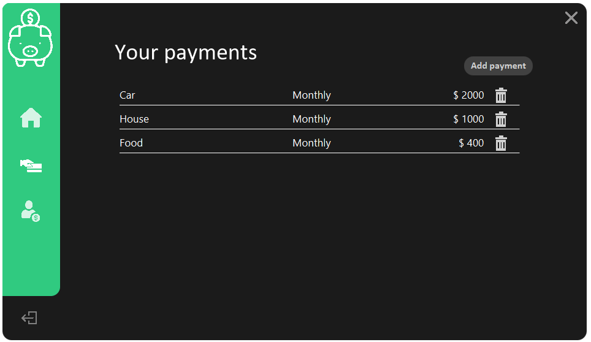

# Monthly savings

Simple user interface, where the user can give information about income, how much they spend on taxes, food etc. each month, then calculates how much money you have left. If you want to try it on your own machine, change the strings in "setupServer()" (it is commented) method inside the MainUI class, so that it works on your own server (the Java version used for this project is 1.8.0_144).

# The Process

First I tried to learn more about MSSQL and Hibernate by programming an application that uses the software. I started by simply making a command line version for the application and thought it would be fun to create something with visuals, as seen on the pictures below. The libraries used for this project is:
- Javafx for visuals
- Hibernate (framework for creating tables etc. in the database: https://hibernate.org/orm/releases/5.4/)
- MS SQL (Microsoft SQL Server, used locally: com.microsoft.sqlserver:mssql-jdbc:8.2.2.jre8)
- Google Guava (Used for hashing: com.google.guava:guava-gwt:23.0)

# Pictures

